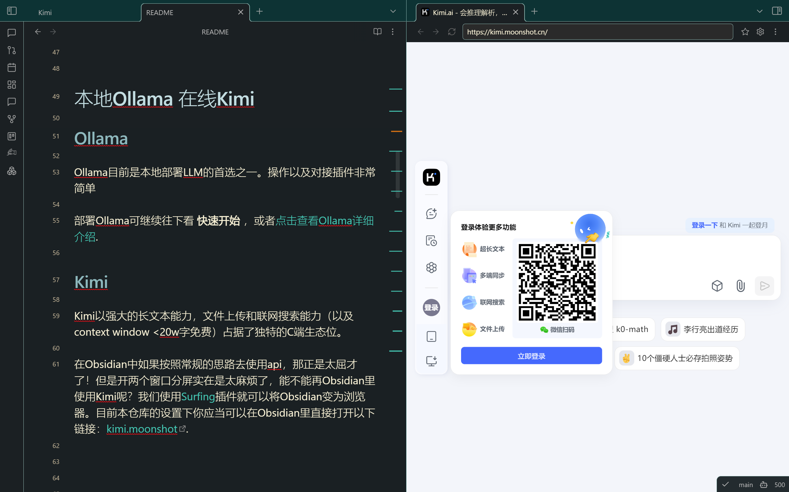
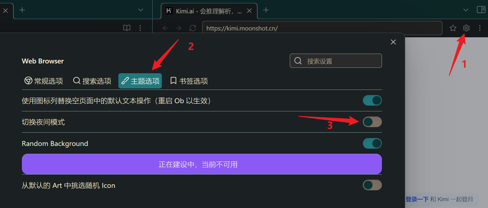
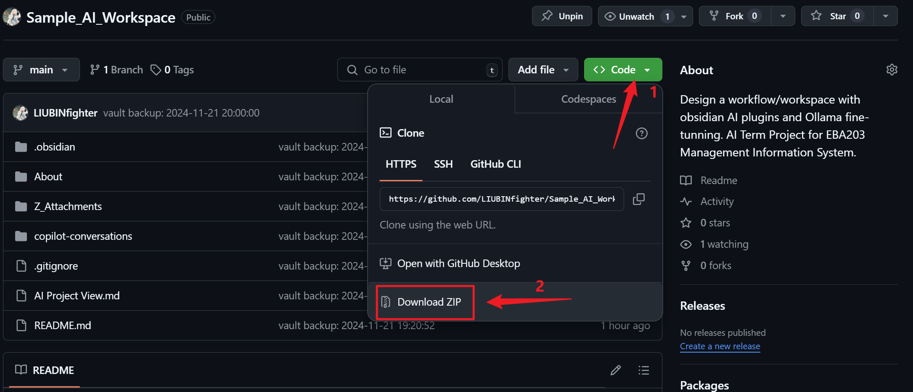
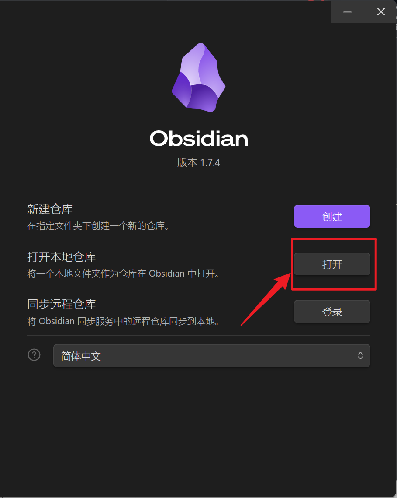
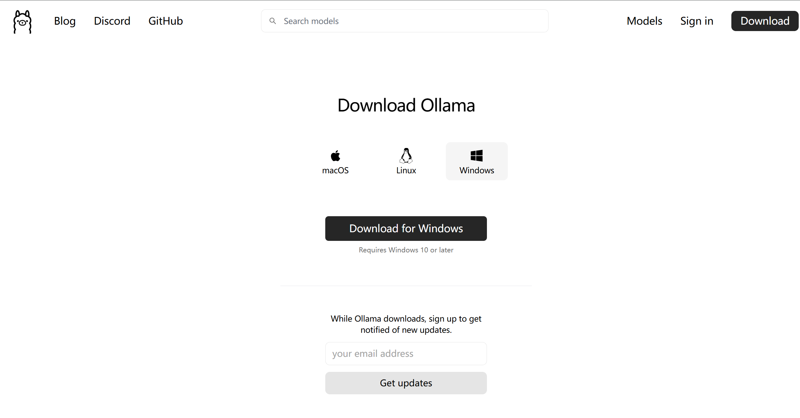
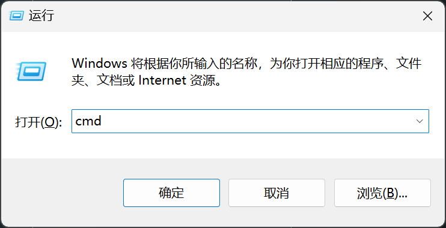
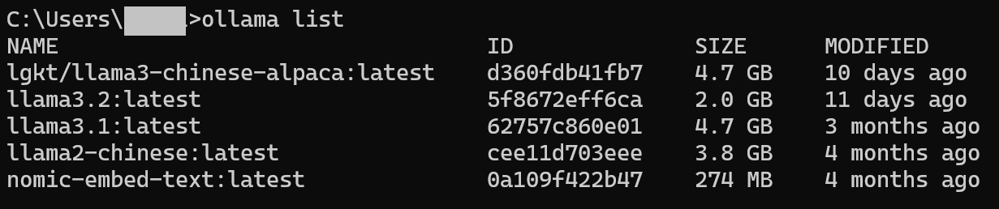
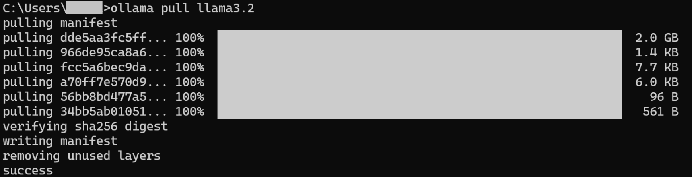
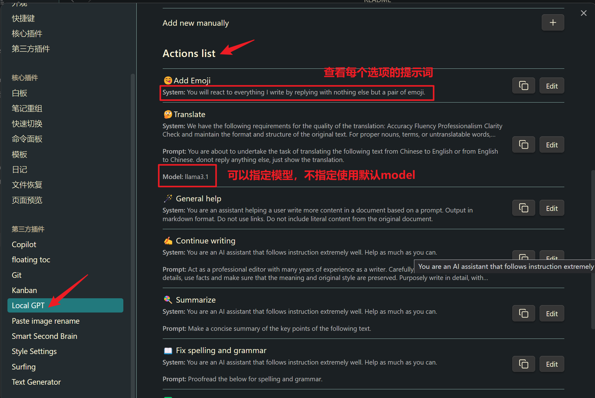

---

## Overview

本仓库是为了向 Obsidian 新手介绍 Obsidian 中的 AI 工作流而打造的。

-> 本博客是为了推广仓库以及写初步教程。阅读最新的进展可以去 github。想要直接看效果可以看博客之前的视频+图片示例：[AI|Obsidian|演示用|打造丝滑Ob+本地AI写作工作流](/blog/posts/2024/ai-powered-obsidian/)

项目地址：[https://github.com/LIUBINfighter/Sample_AI_Workspace](https://github.com/LIUBINfighter/Sample_AI_Workspace)

Obsidian 的学习曲线本就比较陡峭，如果再加上自己部署 LLM 服务则要同时学习 LLM 部署和 Obsidian 各 AI 插件的对接。我对本仓库的设计以及对应文档的写作就是 Obsidian 新手加快将 AI 融入 Obsidian 工作流的进程，按图索骥修改配置后根据效果自行取舍和进行个性化设置。

本次使用的 AI 插件为（排名为个人喜好）：

- Local GPT
  - 脱离鼠标，只用键盘，提示词定制程度高，在文档中丝滑写作，添加表情包，概括，整理思路，修改错误
- Text Generator
  - 定制程度极高，上限高
  - 可以自行根据 LLM 服务商手册+Advanced Setting 自由定制
- Copilot
  - 新兴插件，期待前途
- Smart2Brain
  - 最早入坑的插件，之后效果不是很稳定，现在开发者也不活跃
  - （凑数的）

为了更大程度发挥各 AI 插件的功能，我根据我自己的习惯设置了其他的插件，包括：

- Kanban
  - 看板插件，所有文档分类一目了然
- Surfing
  - 在 Obsidian 中内置浏览器，进行搜索和在线 LLM 使用（Kimi 赛高！）
- Git 以及本地化
  - 远程同步 github 仓库，保存你的项目进度
  - （保持本地化可直接 zip 下载/取消/删除插件）

> 对本地化有执念？担心仓库联网？请查阅：[Git以及本地化](https://github.com/LIUBINfighter/Sample_AI_Workspace/blob/main/docs/Git%E4%BB%A5%E5%8F%8A%E6%9C%AC%E5%9C%B0%E5%8C%96.md) 文档.

## 插件横纵对比

Obsidian 仓库设置，当然要以插件为主啦！所以我们优先介绍插件。以下内容主要都依据 2024 年 11 月 22 日访问+使用并制表。

如果有些糊涂，可以略过两个枯燥的表格，直接看我的主观体验就行。

对表格中的细节有疑惑，直接点击表格中的文件链接即可跳转（这里假设是 obsidian 环境）。

> update: 将文件路径替换为完整相对路径后，在 github 上也可以完整预览本仓库的绝大多数文档。

### 基本情况

Repo 为插件 github repo 地址。

| Name           | Repo                                                                                                | Download | Star | Update      |
| -------------- | --------------------------------------------------------------------------------------------------- | -------- | ---- | ----------- |
| Text Generator | [nhaouari/obsidian-textgenerator-plugin](https://github.com/nhaouari/obsidian-textgenerator-plugin) | 335k     | 1.5k | 3weeks ago  |
| Local GPT      | [pfrankov/obsidian-local-gpt](https://github.com/pfrankov/obsidian-local-gpt)                       | 18.7k    | 328  | last week   |
| Copilot        | [logancyang/obsidian-copilot](https://github.com/logancyang/obsidian-copilot)                       | 264k     | 3.1k | 9 hours ago |
| Smart2Brain    | [your-papa/obsidian-Smart2Brain](https://github.com/your-papa/obsidian-Smart2Brain)                 | 25.1k    | 633  | 6months ago |

非常感谢社区的插件作者以及其他热衷于分享和帮助他人的参与者！

### 功能介绍

对这些细节有疑惑？我会在每个插件单独的文档中详细解释。

| Name           | 边栏 QA | 选定内容输入       | 阅读.md       | 多文件                      | 外链跳转            | 定制提示词                   | 定制传输格式        |
| -------------- | ------- | ------------------ | ------------- | --------------------------- | ------------------- | ---------------------------- | ------------------- |
| Text Generator | ❌      | ✔                 | ✔            | ❌                          | ❌                  | ✔                           | ✔已有模板+自由定制 |
| Local GPT      | ❌      | ✔ 选中+自设快捷键 | ✔            | ❌ 只支持在编辑的文档中解读 | ❌不能多文件联动    | 🔥插件面板设置 +社区支持     | ❌                  |
| Copilot        | ✔      | ✔ 选中+右键       | ✔ 提示词模板 | ✔ 可调整文件数             | ✔较准确 ❌跳转抽风 | 只支持1种自定义System Prompt | ❌                  |
| Smart2Brain    | ✔      | ❌ 手动复制粘贴    | ✔            | ✔ 可调整相似度             | 🤔不太准 ✔跳转稳定 | ❌                           | ❌                  |

### 主观评价

| Name           |                                                                           |
| -------------- | ------------------------------------------------------------------------- |
| Text Generator | 热爱折腾必备，定制化程度取决于耐心和技术文档，接入 Kimi 需要看文档调 body |
| Local GPT      | 使用最频繁，快捷键调用定制提示词模板超好用，脱离鼠标                      |
| Copilot        | 有概括菜单栏以及聊天+仓库问答格式,但是跳转经常不成功                      |
| Smart2Brain    | 多文件阅读挺不错，也会提供地址跳转，简单快速，但是插件容易莫名其妙崩溃    |

### 效果示意

[Example-Summary README](https://github.com/LIUBINfighter/Sample_AI_Workspace/blob/main/_Workspace/Example-Summary.md)

{/* ## Copilot */}

{/* [Documentation | Copilot for Obsidian (obsidiancopilot.com)](https://www.obsidiancopilot.com/en/docs) */}

## 本地 Ollama 在线 Kimi

### Ollama

Ollama 目前是本地部署 LLM 的首选之一。操作以及对接插件非常简单

部署 Ollama 可继续往下看 **[快速开始](https://github.com/LIUBINfighter/Sample_AI_Workspace?tab=readme-ov-file#%E5%BF%AB%E9%80%9F%E5%BC%80%E5%A7%8B)** ，或者[点击查看 Ollama 详细介绍](https://github.com/LIUBINfighter/Sample_AI_Workspace/blob/main/docs/BaseLLM/Ollama.md).

### Kimi

Kimi 以强大的长文本能力，文件上传和联网搜索能力（以及 context window &lt;20w 字免费）占据了独特的 C 端生态位（反正我是不能没有 Kimi 了）。

在 Obsidian 中如果按照常规的思路去使用 api，那真是太屈才了！但是开两个窗口分屏实在是太麻烦了，能不能再 Obsidian 里使用 Kimi 呢？我们使用 [Surfing](https://github.com/LIUBINfighter/Sample_AI_Workspace/blob/main/docs/Surfing.md) 插件就可以将 Obsidian 变为浏览器。目前本仓库的设置下你应当可以在 Obsidian 里直接打开以下链接：[kimi.moonshot](https://kimi.moonshot.cn/).



如果你喜欢暗色主题也可以用 Surfing 切换。



如果你想要接入 API，请参考：[Kimi](https://github.com/LIUBINfighter/Sample_AI_Workspace/blob/main/docs/BaseLLM/Kimi.md)

## 快速开始

本栏目是为了快速使用配置最简单基础，最快速的 Local GPT 插件。

你可以在 Obsidian 下查看 [AI Project View](https://github.com/LIUBINfighter/Sample_AI_Workspace/blob/main/docs/AI%20Project%20View.md) 以浏览感兴趣的其他设置和插件介绍。

下载安装包（git clone 有时会卡住）


解压缩到你想要的位置，通过压缩包下载后解压将不会有 .git 文件夹。如果你会使用 git 则可自行修改仓库名称并添加到 repo。

### 使用 Obsidian 打开



打开后你可以在 Obsidian 里阅读本教程了。当然，别急着关网页！涉及 Obsidian 设置一类操作的时候还是要看网页的。我建议从这一步之后就在 Obsidian 里查看本教程并进行其他操作。

插件已经预设完成，我们去配置 Ollama 作为本地 LLM 服务。

### 配置 Ollama

#### Ubuntu

我们用 snap 下载 ollama，其他操作和 windows 没有太大区别。

```bash
sudo snap install ollama
```

#### Windows



`win+r` 呼出
win+R 输入 cmd 运行 enter 确定


输入

```bash
ollama list
```



如果你刚下载 Ollama，那么应当只有 NAME-ID-SIZE-MODIFIED 一行,没有其他的模型。

我们要使用 llama3.2（Local GPT 只需要这个，用于 Chat）以及 nomic-embed-text（Copilot 以及 Smart2Brain 额外需要用于索引）.



我 C 盘够大，模型随便下。但是如果 C 盘本来空间不多，可能需要修改 ollama 配置使得模型文件保存在其他位置。

预设快捷键为 `ctrl+alt+g` 呼出选项卡。

可以手动选中输入内容，不选中则为整个文件的文字为输入。

在插件设置面板中查看 Local GPT Action：（提示词模板）



现在就可以在写作中开开心心的使用 Local GPT 插件了！其他插件的教程会在仓库里陆续更新，有时间我会同步到 Blog.

更多个性化配置参考 [Ollama](https://github.com/LIUBINfighter/Sample_AI_Workspace/blob/main/docs/BaseLLM/Ollama.md) 以及 Ollama 官网 &lt;https://ollama.com/&gt;

## 多余的话

好用给个 Star 吧喵喵喵：&lt;https://github.com/LIUBINfighter/Sample_AI_Workspace&gt;

### Obsidian 链接与 Git Repo

为了保证 README 能在 repo 上完整呈现，我将所有照片等附件都改为了完整相对路径，例如：``。可在设置中重新设置为最简形式，形如：`[[Kimi]]` 或者 `![[Kimi.png]]`。

文档中不定期出现链接错误，是由于 Obsidian 本地使用和 github 在线阅读之间的取舍不同。你可以在 issue 区写下问题和你的建议。

## 外链

### Obsidian Plugin

| Name           | Github Repo                                                                                         | doc/wiki                                                                                                                                    |
| -------------- | --------------------------------------------------------------------------------------------------- | ------------------------------------------------------------------------------------------------------------------------------------------- |
| Text Generator | [nhaouari/obsidian-textgenerator-plugin](https://github.com/nhaouari/obsidian-textgenerator-plugin) | - &lt;https://text-gen.com/&gt; - &lt;https://docs.text-gen.com/&gt;                                                                        |
| Local GPT      | [pfrankov/obsidian-local-gpt](https://github.com/pfrankov/obsidian-local-gpt)                       |                                                                                                                                             |
| Copilot        | [logancyang/obsidian-copilot](https://github.com/logancyang/obsidian-copilot)                       | - [obsidian copilot](https://www.obsidiancopilot.com/en) - [Documentation \| Copilot for Obsidian](https://www.obsidiancopilot.com/en/docs) |
| Smart2Brain    | [your-papa/obsidian-Smart2Brain](https://github.com/your-papa/obsidian-Smart2Brain)                 |                                                                                                                                             |

### LLM Provider

| Name     | Docs                                                                                                                   | 在线使用 Kimi                                                                                                                            |
| -------- | ---------------------------------------------------------------------------------------------------------------------- | ---------------------------------------------------------------------------------------------------------------------------------------- |
| Moonshot | [Moonshot AI 开放平台](https://platform.moonshot.cn/docs/intro#%E6%96%87%E6%9C%AC%E7%94%9F%E6%88%90%E6%A8%A1%E5%9E%8B) | [Kimi.ai - 会推理解析，能深度思考的AI助手 (moonshot.cn)](https://kimi.moonshot.cn/)                                                      |
|          | 官网                                                                                                                   | Github Repo                                                                                                                              |
| Ollama   | [Ollama](https://ollama.com/)                                                                                          | [ollama/ollama: Get up and running with Llama 3.2, Mistral, Gemma 2, and other large language models.](https://github.com/ollama/ollama) |