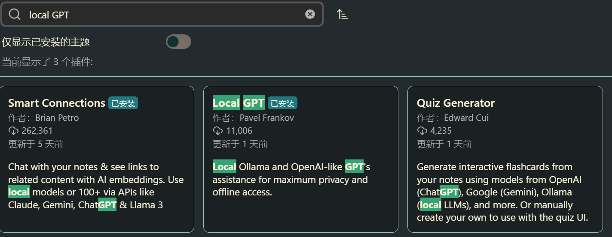
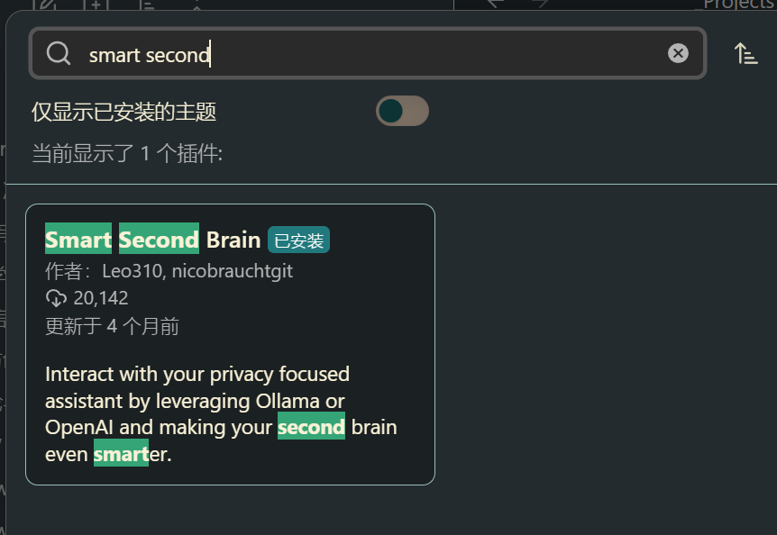

## 前言：一坑未平一坑又起

决策系列在更了在更了（），学校的课表变动非常大，这几天疯狂赶作业中。

## 初步演示

这篇文章介绍 ollama 部署本地 AI + obsidian 插件接入的方法。可能一篇文章更不完，需要把一些技术问题单独拎出来写。在进行微调和知识库索引前，我们先分为本地 AI 部署和 OB 插件两端进行介绍。

AI 端：在线部署需要调用 openai 格式的 api；本地我们使用 ollama。ollama 的设计思想和 docker 很像，把 llm 运转所需的环境依赖打包运行，支持市面上非常多的大模型在 cmd 直接下载，很适合本地部署。模型我们使用未经过微调的 llama3.1-7B。部署设备移动端 4060，显存 8G 速度很快够用，对中文支持有需求的建议暂时使用 llama2-chinese 或者调用社区微调+手动编写 modelfile。这不算啥大问题，更换 llm 在 ollama 一行代码的事。我们先跑通再说。

Ob 插件：我个人体验过不少 Ob-AI 插件，本次向大家推荐我使用频率最高，目前效果也是最好的两个插件

1. Local GPT



2. smart second brain



> （原本这里计划放一个演示视频：`Obsidian_AI_plugins_workflow.mp4`，暂未启用。如需添加，可在此处插入：
>
> ```mdx
> <video
>   controls
>   style={{ width: "100%", height: "auto" }}
>   src="./Obsidian_AI_plugins_workflow.mp4"
> />
> ```
>
> 注意：若使用 JSX 形式 `<video>`，不要再用 `{/* ... */}` 把整块包裹注释（会被 Prettier 重新排版导致 acorn 误判）；若只是暂时隐藏，直接删除不要保留"多行 JSX 注释"即可。）
